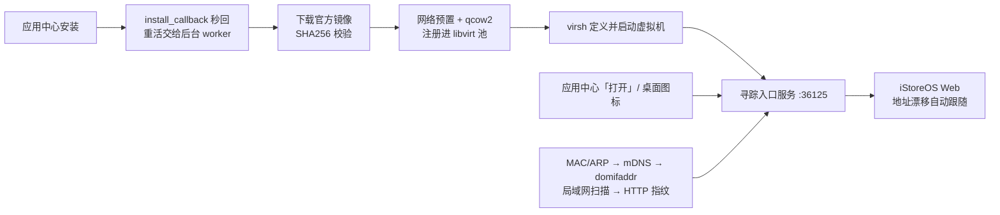

<p align="center">
  <br/>
  <b>iStoreOS for fnOS</b><br/>
  在飞牛 NAS 上把 iStoreOS 装成一台虚拟机，装完只管用一个入口访问<br/><br/>
  <a href="../../releases/latest"></a>
  
  
  <a href="https://www.istoreos.com/"></a>
</p>

<p align="center">
  <br/>
  <b>固定入口 <code>:36125</code> 的三种状态</b><br/>
  已关机可一键开机 · 启动过程说清卡在哪 · 拿不到 IP 时经串口自救
</p>

---

## 快速开始

| # | 做什么 | 说明 |
|---|---|---|
| 1 | [下载 FPK](../../releases/latest) | 当前 `1.1.10` · SHA256 `5993af3490f5bcd15d7b59a7bfd955472df69899963a8b623359f6faed00123b` |
| 2 | 应用中心 → 手动安装 | 向导选 iStoreOS 版本 / CPU / 内存 / 是否随 NAS 自启 |
| 3 | 等后台跑完 | 提交后**立即返回**；全新安装 25.12.5、24.10.8 约 4 分钟，22.03.7 约 11 分钟，磁盘已存在约 10~40 秒 |
| 4 | 打开 `http://<NAS 地址>:36125/` | 应用中心「打开」和桌面图标都走这里，自动跟随虚拟机 IP 变化 |

> [!NOTE]
> **运行要求**：fnOS x86_64 + 已装飞牛「虚拟机」应用（需 `/dev/kvm`）· 安装卷剩余 ≥ 2GB · 主路由 DHCP 可用

> [!TIP]
> **装到一半没动静**：看安装进度 `cat /tmp/istoreos-install.state`（`queued → downloading → verifying → extracting → provisioning → defining-vm → ready`）

---

## 工作原理



**一句话总结**：安装时不占用平台回调的 190 秒窗口，虚拟机建好之后，应用中心那个**固定不变**的入口端口负责实时找到虚拟机的真实地址并跳过去——所以 DHCP 换了 IP、甚至换了 iStoreOS 版本，你都不用改快捷方式。

---

## 功能一览

| 能力 | 说明 |
|---|---|
| **固定入口** | 五级寻踪（MAC/ARP → mDNS → domifaddr → 局域网扫描 → HTTP 指纹），DHCP 地址漂移无感 |
| **状态透明** | 分「未开机 / 正在启动 / 还在获取地址 / Web 未就绪 / 已就绪」显示，开关机态每次都跟虚拟机实际状态核对 |
| **串口网络修复** | 拿不到 IPv4 时在入口页经 libvirt 串口重新获取 IP、设静态地址、重启网络、手动指定跳转地址，**不依赖虚拟机有网络** |
| **停用/启用联动** | 停用即 ACPI 优雅关机；在入口页点开机也会把应用中心状态同步回来 |
| **数据不丢** | 磁盘常驻 `/vol1/vm/pool/istoreos.qcow2`，重装原样复用；改选别的版本先把旧盘整块留档到 `/vol1/vm/backup`；重装沿用网卡 MAC，路由器绑定不失效 |
| **秒回安装** | 规避 fnOS 约 190 秒的安装回调看门狗；中断后点「启动」按原参数续跑 |

---

## 默认端口

| 端口 | 位置 | 说明 |
|---|---|---|
| **36125** | NAS | 寻踪入口服务，应用中心「打开」与桌面图标都指向它 |
| **80** | 虚拟机 | iStoreOS（LuCI）Web 界面，由入口自动跳转过去 |

> [!NOTE]
> 入口服务 7×24 常驻占用 36125，因此 `manifest` 里 `checkport=false`——否则应用「停用」后再启用会被平台判端口冲突而启不来。

---

## 支持的镜像

| 向导选项 | 官方文件（[`fw.koolcenter.com/iStoreOS/x86_64_efi/`](https://fw.koolcenter.com/iStoreOS/x86_64_efi/)） | SHA256 |
|---|---|---|
| **25.12.5**（默认） | `istoreos-25.12.5-2026091113-…-combined-efi.img.gz` | `a89206e3238c…` |
| 24.10.8 | `istoreos-24.10.8-2026073111-…-combined-efi.img.gz` | `8825143bc8e4…` |
| 22.03.7 | `istoreos-22.03.7-2025050912-…-combined-efi.img.gz` | `bda277850a2c…` |

> [!NOTE]
> 24.10.8 / 22.03.7 官方 gz 尾部带杂散字节，`gunzip` 会报 `trailing garbage ignored` —— 内容等价、校验通过，安装器已容忍（该场景返回码非 0 非 1，不能当失败处理）。

---

## 卸载与数据

应用中心卸载只删虚拟机定义与寻踪服务，**qcow2 磁盘和你的配置不会被删**，重装即复用。

> [!WARNING]
> 要彻底清掉系统数据，需先停用应用，再手动删 `/vol1/vm/pool/istoreos.qcow2`（建议先备份一份）。换版本时旧盘会自动留档到 `/vol1/vm/backup/`，不会静默覆盖。

---

## 仓库结构

```
├── manifest              # FPK 元数据、服务端口、checkport
├── cmd/                  # 生命周期回调（install / config / upgrade / uninstall 与 main）
├── config/               # 权限与资源声明（privilege / resource）
├── app/
│   ├── bin/              # 安装 worker、镜像离线预置、寻踪入口服务、服务登记同步
│   └── ui/               # 桌面图标与应用注册（images / config）
├── wizard/               # 安装与设置向导（版本 / CPU / 内存 / 自启）
└── docs/                 # README 配图
```

---

## 从源码构建

```bash
fnpack build -d .        # 产出 com.istoreos.vm.fpk，文件名补上版本号即可发布
```

---

## 📄 许可证

本项目遵循 [MIT License](LICENSE) 许可证。本仓库仅为飞牛 fnOS 平台的部署封装，不包含 iStoreOS 系统本身，iStoreOS 版权归其原作者所有。

---

## 🙏 致谢

- [istoreos / iStoreOS](https://github.com/istoreos/istoreos) —— 人人都能用的路由 · NAS 系统（官方站点 [istoreos.com](https://www.istoreos.com/)，镜像源 [fw.koolcenter.com](https://fw.koolcenter.com/iStoreOS/x86_64_efi/)）
- [RROrg/fn-apps](https://github.com/RROrg/fn-apps) —— 项目结构与脚本参考
- [飞牛 fnOS](https://www.fnnas.com/) —— 提供友好的 NAS 操作系统体验

---

<div align="center">

**如果觉得好用，顺手点个 ⭐ Star 支持一下！**

Made with ❤️ by [Blue-Mink](https://github.com/Blue-Mink)

</div>
